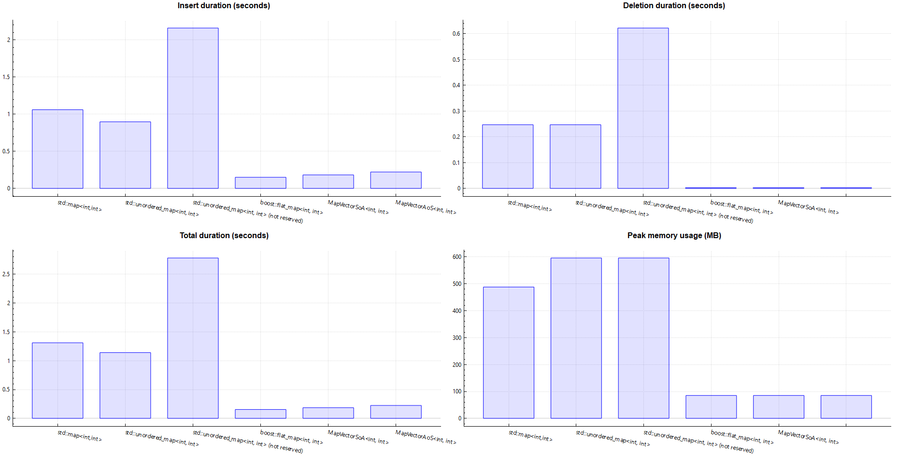
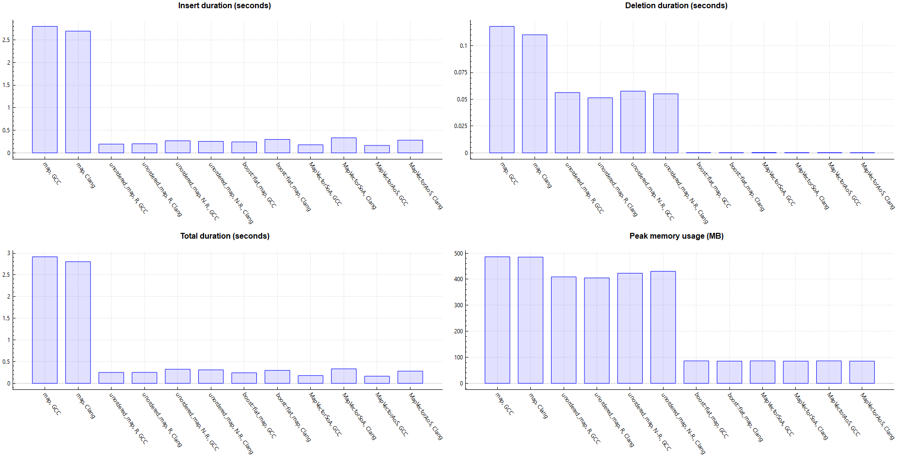

# Performance benchmarking for map-implementations

## Update history

* 2024-03-30: added example 4: 10 million in-order inserts to int->int -map: time and memory usage
    * 2024-04-09: added std::unordered_map without reserve() to comparisons
    * 2024-04-21: added results from GCC and Clang.
* 2017-04: added example 3
* 2017-03: added examples 1 and 2

## General

This document present some performance aspects related to various map implementations, namely
* std::map
* std::unordered_map
* boost::flat_map
* dfglib::MapVectorAoS
* dfglib::MapVectorSoA
* Draft implementations of flat map proposals (before std::flat_map) (only in example 3)

Instead of looking at performance as function of element count, the focus is to give concrete examples at some arbitrarily chosen element count and use case.

Compilers and tools used:
* Examples 1-3: code was compiled with MSVC2015 update 3 for x86 (32-bit), boost 1.61.0
* Example 4: documented in the example itself

Note that while these benchmarks compare maps, results of tests that only use key's are probably more or less applicable to corresponding set-implementations.

### Disclaimer

Benchmarking is a tricky field and while the results provided are made with the intention of being correct enough to provide insights on some performance aspects, note that:

* Cases concentrate on isolated examples and are not to be over-generalized
* Compilers, standard libraries etc. can have a major effect on the results
* Author is not an benchmarking expert

---

## 1. Example: Insert performance with \<int, int\> maps to random positions

This benchmarked insert time of 50000 random integers which resulted to map of size 49936 (i.e. 64 ints were duplicates). The detailed  test code, that uses revision [06f3ceb678b9e39f0462d40378a11fd18145dee3](https://github.com/tc3t/dfglib/tree/06f3ceb678b9e39f0462d40378a11fd18145dee3) of dfglib, can be found from [here](dfgTestContMapVectorPerformance.cpp), but essentially the code measured the time taken by the following loop:
```C++
for (int i = 0; i < 50000; ++i)
{
    auto key = random_integer_in_range(-10000000, 10000000);
    cont.insert(std::pair<int, int>(key, key));
}
```

Below is a chart showing the times for different maps and a table with relative times (the raw result table can be found from [here](benchmarkMapVectorInsertPerformance_MSVC_2015_u3_32_release.csv).)


| Container     | Relative time (median time) | 
| ------------- | ------------- |
| Interleaved std::vector (50000 pairs) | 0.22 |
| Interleaved boost::vector (50000 pairs) | 0.29 |
| MapVectorAoS push-sort-unique, reserved | 1.00 |
| MapVectorAoS push-sort-unique, not reserved | 1.01 |
| std::unordered_map | 1.65 |
| std::map | 2.48 |
| MapVectorAoS, sorted, not reserved | 32.85 |
| MapVectorAoS, sorted, reserved | 32.96 |
| MapVectorSoA, sorted, not reserved | 33.06 |
| MapVectorSoA, sorted, reserved | 33.09 |
| MapVectorSoA, not sorted, reserved | 72.90 |
| MapVectorSoA, not sorted, not reserved | 73.19 |
| boost::flat_map | 78.69 |
| MapVectorAoS, not sorted, not reserved | 80.38 |
| MapVectorAoS, not sorted, reserved | 80.49 |

The graph and the table shows that the differences are big as expected: almost two orders of magnitude. Notes:

* Both sorted MapVector's are much faster than boost::flat_map. This is essentially a concequence of differences in vector insert performance, which has been analysed in a [separate document](https://github.com/tc3t/benchmarks/blob/master/vectorInsert/vectorInsertBenchmarking.md).

* The fastest time is achieved with vector-based map, which allows the use of push-sort-unique -technique, i.e. push everything to map, sort and remove duplicates.

* For vector-based maps, reserve() has practically no effect on the results.

---

## 2. Example: Find performance with \<int, int\> maps

This benchmarked find times from the maps constructed in Example 1 using 250000 random keys with find percentage of about 0.25 %. The timed code was essentially the following (for the actual test code see the links in Example 1):

```C++
for (int i = 0; i < 250000; ++i)
{
    auto key = random_integer_in_range(randEng, -10000000, 10000000);
    nFound += (cont.find(key) != cont.end());
}
```

Result are below in graphical form and as table (non-sorted maps are not included in the chart). The raw result table can be found from [here](benchmarkMapVectorFindPerformance_MSVC_2015_u3_32_release.csv)):


| Container     | Relative time (median time) | 
| ------------- | ------------- |
| std::unordered_map | 1.00 |
| boost::flat_map | 2.39 |
| MapVectorSoA, sorted | 2.48 (*) |
| MapVectorAoS, sorted | 2.51 (*) |
| std::map | 3.75 |
| MapVectorSoA, not sorted | 296.18 (*) |
| MapVectorAoS, not sorted | 331.66 (*) |

\(*) Average of two 5 iteration runs.

Notes:

* std::unordered_map is clearly the fastest as expected.
* boost::flap_map is slightly faster than MapVector's suggesting a quality of implementation issue in MapVector.
* Vector-based maps are faster than std::map as expected.
* For non-sorted case that does a linear search, the better performance of MapVectorSoA is reckoned to be the result of better locality when searching keys (SoA has separate arrays for keys and values instead of storing array of pairs).

---

 ## 3. Example: Finding map keys of type std::string using const char* as search parameter

Until C++14, std::map find() took key_type as parameter and thus passing const char* to find() of a map with std::string keys forced creation of std::string, which could also mean a memory allocation. This example examines the effect in some cases using pre C++14 behaviour and dfglib revision [5cebbad64e0066f8c733cc8018ecdc22a53c9d17](https://github.com/tc3t/dfglib/tree/5cebbad64e0066f8c733cc8018ecdc22a53c9d17).

 ### 3.1 Test overview

Using various map-implementations, the following code was run.

 * 1. Create N path-like std::string keys to map all of which are of format "c:/an/example/path/file{}.txt", where '{}' is replaced by a running index in range [0, N).
 * 2. For M times, randomly pick a const char* from a static array and pass it to map's find(). The strings are:
    * "c:/an/example/path/file5.txt",
    * "c:/an/example/path/file55",
    * "d:/temp",
    * "C:/temp",
    * "c:/an/example/path/file1.txt",
    * "c:/an/example/path/file.txt"

Time was measured for step 2 with the following implementations with key_type = std::string, mapped_type = int:

* std::map
* std::unordered_map
* boost::container::flat_map
* P0460R0 flat_map draft ([proposal](http://www.open-std.org/JTC1/SC22/WG21/docs/papers/2016/p0460r0.pdf), [code](https://github.com/WG21-SG14/flat_containers/tree/master/source) and a [single line edit](P0460R0_flat_map.diff) to make it compile)
* Pubby flat_map draft ([proposal](http://pubby.github.io/proposal.html), [code](https://github.com/pubby/flat))
* MapVector's (AoS and SoA with both sorted and unsorted)

With parameters N = 3, M = 33333333 (i.e. tiny map and huge number of find()-calls), the results looked like the following (using median time of 5 runs):

| Container     | Relative time (median time) | 
| ------------- | ------------- |
| MapVectorSoA, not sorted | 1.000 |
| MapVectorAoS, not sorted | 1.003 |
| MapVectorSoA, sorted | 1.23 |
| MapVectorAoS, sorted | 1.27 |
| P0460R0 flat map | 1.40 |
| std::unordered_map | 2.04 |
| std::map | 2.04 |
| boost::flat_map | 2.21 |
| pubby flat map | 3.81 |

With tiny map, the search time is small and the memory allocation forced by pre C++14 std and boost implementations is relatively expensive making MapVector and P0460R0 flat map clearly the fastest. The reason for MapVector performing significantly better than P0460R0 flat map is probably due to the search type optimization in MapVector: while find() takes const char\*, the actual search is done using a string view which avoids redundant strlen() calls (at least in VC2015 std::string() < "abc" will call strlen() on "abc" on each comparison).

With parameters N = 1000, M = 10000000 (i.e. much bigger map causing searching to be more expensive), the results looked like the following:

| Container     | Relative time (median time) | 
| ------------- | ------------- |
| MapVectorSoA, sorted | 1.00 |
| MapVectorAoS, sorted | 1.03 |
| std::map | 1.31 |
| std::unordered_map | 1.33 |
| boost::flat_map | 1.43 |
| P0460R0 flat map | 1.81 |
| MapVectorSoA, not sorted | 5.13 |
| pubby flat map | 6.14 |
| MapVectorAoS, not sorted | 6.91 |

Raw result table can be found from [here](benchmarkStringMapWithCharPtrLookup_MSVC_2015_u3_32_release.csv).

Notes:

* While unordered_map has [constant on average complexity](http://en.cppreference.com/w/cpp/container/unordered_map/find), it's clearly slower than the best flat map implementations and is even slightly slower than std::map.
* Bad performance of P0460R0 flat map might be due to the std::string, const char* comparison issue discussed earlier.
* Pubby flat map is much slower than other flat maps.
* There's a rather significant difference between unsorted versions of MapVectorSoA and MapVectorAoS, this might be due to the better key locality in SoA-map.

 ### 3.2 Observations and notes

* find() is an example of an interface that can be inefficient by design by forcing creation of redundant object...
* ...but it can actually also be slower to use template type for find() instead of key_type as demonstrated by the performance characteristics of operator< (i.e. comparing two std::string's can be much faster than comparing std::string and const char* if the implementation recalculates length of const char* on each comparison). This is quite interesting: the C++14 template find() can actually also reduce performance depending on the map type and data.
* There are big differences between performances of flat map implementations reminding that the data structure is just one part of the puzzle.
* These results are for a specific type of data and run on a single compiler. Also the seemingly better results of MapVector compared to other flat_maps are the result of a 'std::string \& const char\*' -specific optimization: the effect depends on data.

---

## 4. Example: Inserting in order: times and memory usage

Added 2024-03.

### 4.1 Overview

This example examines map performance characteristics for case where int->int map is filled in-order:
1. How long it takes to push 10 million int-to-int pairs to map?
2. How much memory such map uses?
3. How long it takes to destroy the map?

Simplified version of the [code](mapSimpleInsert/mapSimpleInsert.cpp):
```C++
{
    Map_T<int, int> m;
    m.reserve(10000000); // Reserving memory if map has reserve()
    // 1. How long this insert loop takes
    for (int i = 0; i < 10000000; ++i)
        inserter(m, i, i);
    // 2. How much memory is in use at this point
}
// 3. How long it took to delete objects in the scope.

```

### 4.2 Numerical results

#### 4.2.1 MSVC 2022.9

Run on Windows 11, x86-64

| Map type | Insert time | Deletion time | Total time | Memory usage |
| -------- | ----------- | ------------- | ---------- | ------------ |
| boost::flat_map (*) | 1.0 (150 ms) | 1.0 (2.80 ms) | 1.0 (154 ms) | 1.0 (85.1 MB) |
| dfglib::MapVectorSoA | 1.21 (182 ms) | 1.04 (2.91 ms) | 1.20 (185 ms) | 1.0 (85.1 MB) |
| dfglib::MapVectorAoS | 1.47 (221 ms) | 1.08 (3.03 ms) | 1.45 (224 ms) | 1.0 (85.1 MB) | 
| std::map | 7.07 (1060 ms) | 88 (247 ms) | 8.51 (1310 ms) | 5.73 (488 MB) |
| std::unordered_map (reserved) | 5.98 (897 ms) | 88 (247 ms) | 7.40 (1140 ms) | 7.00 (596 MB) |
| std::unordered_map (not reserved) | 14.4 (2160 ms) | 222 (622 ms) | 18 (2780 ms) | 7.00 (596 MB) |

(*) Boost version 1.81

Raw data files available in [results.csv](mapSimpleInsert/results.csv) and [results_summary.csv](mapSimpleInsert/results_summary.csv).



#### 4.2.2 GCC & Clang

Run under WSL Ubuntu 22.04 in Windows 11 (the same machine as in MSVC case). All map-flavours were compiled to separate files and run 5 times in a loop with logic of [run_tests.sh](mapSimpleInsert/run_tests.sh).

<!-- Table generated from results_gcc_clang_summary_for_md.csv
     with csv2md (https://www.npmjs.com/package/csv2md)
     using command: csv2md --pretty --csvDelimiter ";" results_gcc_clang_summary_for_md.csv
 -->
| Map type                           | Insert time     | Delete time      | Total time      | Memory usage  | Compiler     | Standard library |
|------------------------------------|-----------------|------------------|-----------------|---------------|--------------|------------------|
| boost::flat_map                    | 1.47 (242 ms)   | 1.03 (0.157 ms)  | 1.47 (242 ms)   | 1.01 (86 MB)  | GCC_11.3.0   | libstdc++ ver 11 |
| boost::flat_map                    | 1.81 (297 ms)   | 1.00 (0.152 ms)  | 1.81 (297 ms)   | 1.00 (85 MB)  | Clang_14.0.0 | libc++ ver 14000 |
| MapVectorSoA                       | 1.09 (179 ms)   | 1.87 (0.285 ms)  | 1.09 (179 ms)   | 1.01 (86 MB)  | GCC_11.3.0   | libstdc++ ver 11 |
| MapVectorSoA                       | 2.03 (333 ms)   | 1.29 (0.197 ms)  | 2.03 (333 ms)   | 1.00 (85 MB)  | Clang_14.0.0 | libc++ ver 14000 |
| MapVectorAoS                       | 1.00 (164 ms)   | 1.26 (0.192 ms)  | 1.00 (164 ms)   | 1.01 (86 MB)  | GCC_11.3.0   | libstdc++ ver 11 |
| MapVectorAoS                       | 1.71 (280 ms)   | 1.01 (0.154 ms)  | 1.71 (281 ms)   | 1.00 (85 MB)  | Clang_14.0.0 | libc++ ver 14000 |
| std::map                           | 17.05 (2800 ms) | 774.72 (118 ms)  | 17.74 (2920 ms) | 5.70 (486 MB) | GCC_11.3.0   | libstdc++ ver 11 |
| std::map                           | 16.41 (2690 ms) | 723.33 (110 ms)  | 17.06 (2800 ms) | 5.69 (485 MB) | Clang_14.0.0 | libc++ ver 14000 |
| std::unordered_map (reserved)      | 1.19 (195 ms)   | 369.02 (56.2 ms) | 1.53 (251 ms)   | 4.80 (409 MB) | GCC_11.3.0   | libstdc++ ver 11 |
| std::unordered_map (reserved)      | 1.22 (200 ms)   | 337.58 (51.4 ms) | 1.53 (252 ms)   | 4.75 (405 MB) | Clang_14.0.0 | libc++ ver 14000 |
| std::unordered_map (not reserved)  | 1.63 (267 ms)   | 377.90 (57.6 ms) | 1.97 (324 ms)   | 4.96 (423 MB) | GCC_11.3.0   | libstdc++ ver 11 |
| std::unordered_map, (not reserved) | 1.55 (254 ms)   | 361.64 (55.1 ms) | 1.88 (309 ms)   | 5.05 (430 MB) | Clang_14.0.0 | libc++ ver 14000 |

Boost version 1.74

Raw data files available in [results_gcc_clang.csv](mapSimpleInsert/results_gcc_clang.csv) and [results_gcc_clang_summary.csv](mapSimpleInsert/results_gcc_clang_summary.csv).

And the same in chart-form:




### 4.3 Discussion

* While there were major differences between different compilers and standard libraries, the following were common patterns:
    * std::map was clearly the slowest: 8-17 times slower than fastest flat map alternative.
    * All non-flat maps used a lot more memory than flat maps: around 4-8 times more.
    * With non-flat maps, also deletion of the map-object can take significant time.
* Results of std::unordered_map varied a lot between different compilers:
    * On MSVC:
        * std::unordered_map was similar to std::map in performance and memory usage. In addition reserve() had major effect on the results.
    * On GCC and Clang:
        * Performance of std::unordered_map was about the same as flat maps and effect of reserve() was much smaller than in MSVC.

While std::map/unordered_map are notably faster for inserts to random positions as shown in example 1, factor of 4-8 in memory use can be significant for big maps. So even when performance of random position inserts is important, may need to evaluate if application can affort it if it means that memory consumption is e.g. over 1 GB instead of 200 MB. But if map performance characteristics are crucial, then maybe none of the map types evaluated here is the best candidate, but e.g. memory use in such data structure should probably be much closer to that of flat map instead of std::map/unordered_map.

And worth emphasizing that these figures are just from one particular use scenario. For example in addition to insert pattern effects, relative memory usage differences are dependent on data types: with bigger elements relative overhead is smaller in non-flat maps. Also if map data types have different sizes (e.g. int -> char, int64 -> int32), SoA-style flat maps are even better in memory usage as they do not need to pay for padding overhead that pair-based maps have: for example with int64->int32 (8+4=12 bytes) pair would be padded to have size 16, so padding introduces 33 % space overhead.

---

## References and related content

* std::flat_map (since C++23): https://en.cppreference.com/w/cpp/container/flat_map
* Flat map paper R9: https://www.open-std.org/jtc1/sc22/wg21/docs/papers/2022/p0429r9.pdf
    * "the latest paper approved by LEWG" providing design rationales: https://www.open-std.org/jtc1/sc22/wg21/docs/papers/2017/p0429r3.pdf
    * Earlier version with some performance charts: https://www.open-std.org/jtc1/sc22/wg21/docs/papers/2017/p0429r1.pdf
* A paper from 2019 discussing issues in flat map proposal at that time: https://www.open-std.org/jtc1/sc22/wg21/docs/papers/2019/p1727r0.pdf
* Stackoverflow question "boost::flat_map and its performance compared to map and unordered_map" asked in 2014, answers include a lot of benchmarks: https://stackoverflow.com/questions/21166675/boostflat-map-and-its-performance-compared-to-map-and-unordered-map
* Stackoverflow question "Is there any difference between map and unordered_map in c++ in terms of memory usage?" asked in  2019: https://stackoverflow.com/questions/56438738/is-there-any-difference-between-map-and-unordered-map-in-c-in-terms-of-memory
* "Should you be using something instead of what you should use instead?" https://scottmeyers.blogspot.com/2015/09/should-you-be-using-something-instead.html

---

## Miscellaneous

* Details on test machines (listed in raw results file in column 'Test machine')
    * 1: 
        * OS: TODO
        * CPU: TODO

